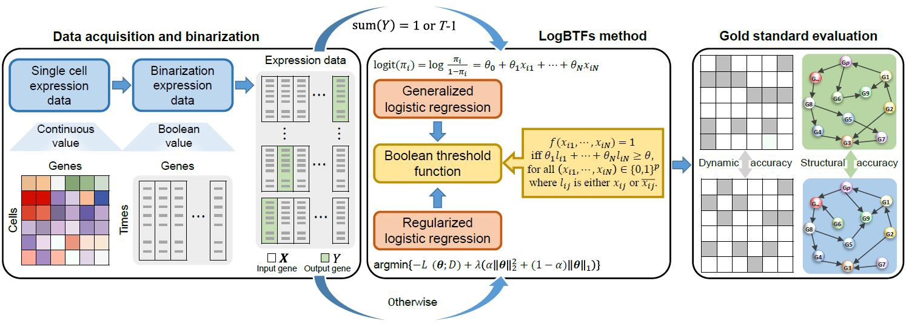

# [LogBTF: Gene regulatory network inference using Boolean threshold network model from single-cell gene expression data](https://github.com/zpliulab/logBTF)



This work proposes an **embedded Boolean threshold network model by aggregating logistic regression with Boolean threshold function (LogBTF)** to infer gene regulatory networks from single-cell gene expression data. 


## LogBTF
<!--START_SECTION:news-->
<!--* **LogBTF**: A **embedded Boolean threshold network model (LogBTF)** is proposed to infer **gene regulatory networks (GRNs)**. -->
* **Comparison**: the proposed method **LogBTF** results in better inference performance than one regression-based method **SINCERITIES**, two ordinary differential equation-based methods **GRISLI** and **SCODE**, two miscellaneous methods **GENIE3** and **TIGRESS**, two correlation-based methods **ARACNE** and **CLR**.
* **Reminder**: Before running all programs, you need to **modify the path of the folder** where the corresponding input or output data or function is located.
* If you have any questions about **LogBTF**, please directly contact the corresponding author [Prof. Zhi-Ping Liu](https://scholar.google.com/citations?user=zkBXb_kAAAAJ&hl=zh-CN&oi=ao) with the E-mail: zpliu@sdu.edu.cn
<!--END_SECTION:news-->


## Citation
Li, Lingyu, et al. "**LogBTF: Gene regulatory network inference using Boolean threshold networks model from single-cell gene expression data**." Submit to [Bioinformatics](https://academic.oup.com/bioinformatics). 


## Data
<!--START_SECTION:news-->
* **Data** file give some necessary input/output files by the **R/Matlab/Python** codes. 
<!--* The subfile **DREAM3_RealData2** is the Matsumoto RNA-seq data, and the subfile **DREAM3_RealData16** is the Specific hHEP scRNA-seq data.-->
* Some input files only give the **first few lines**, limited by upload file size, but this does not affect the results.
* **Supplementary Materials** file present the necessary **Additional files** contained in our work.
* **Cytoscape** file give the inferred LMPP gene regulatory network. 
<!--END_SECTION:news-->

## R packages
* [R.utils](https://cran.r-project.org/web/packages/R.utils/index.html) (v2.12.2). For various programming utilities.
* [BiTrinA](https://cran.r-project.org/web/packages/xlsx/index.html) (v0.6.5). Read/write/format Excel 2007 and Excel 97/2000/XP/2003 file formats.
* [caret](https://cran.r-project.org/web/packages/caret/index.html) (v6.0-93). Misc functions for training.
* [Matrix](https://cran.r-project.org/web/packages/Matrix/index.html) (v1.5-3). For the rich hierarchy of matrix classes.
* [BiTrinA](https://cran.r-project.org/web/packages/BiTrinA/index.html) (v1.3). For the binarization of simulated bulk gene expression data.
* [glmnet](https://cran.r-project.org/web/packages/glmnet/index.html) (v4.1-6). To conduct regularized generalized Linear models (Elastic net penalty).
* [ppcor](https://cran.r-project.org/web/packages/ppcor/index.html) (v1.1). Calculating partial and semi-partial (part) correlations in SINCERITIES method.
* [tigress](https://cran.r-project.org/web/packages/tigris/index.html) (v1.6.1). For the implication of TREGRESS method.
* [minet](http://www.bioconductor.org/packages/release/bioc/html/minet.html) (v4.2). For the implication of ARACNE and CLR methods.
    ```ruby
    if (!require("BiocManager", quietly = TRUE))
    install.packages("BiocManager")

    BiocManager::install("minet")
    ```
* [GENIE3](https://bioconductor.org/packages/release/bioc/html/GENIE3.html) (v4.2). For the implication of GENIE3 method.
    ```ruby
    if (!require("BiocManager", quietly = TRUE))
    install.packages("BiocManager")

    BiocManager::install("GENIE3")
    ```
* [randomForest](https://CRAN.R-project.org/package=randomForest) (v4.7-1.1). For the implication of GENIE3 method.
* [pROC](https://cran.r-project.org/web/packages/randomForest/index.html) (v1.18.0). For the display and analyze ROC curves.
* [dplyr](https://cran.r-project.org/web/packages/dtplyr/index.html) (v7.3-58.1). Provides a data.table backend.
* [ggplot2](https://cran.r-project.org/web/packages/ggplot2/index.html) (v3.4.0). Create elegant data visualisations.
* [stringr](https://cran.r-project.org/web/packages/stringr/index.html) (v4.1). Use set of wrappers around the fantastic 'stringi' package.
* [ggprism](https://cran.rstudio.com/web/packages/ggprism/index.html) (v1.0.4). Used to customise ggplots.
* [tidyverse](https://cran.r-project.org/web/packages/tidyverse/index.html) (v1.3.2). share common data representations.
* [reshape2](https://cran.r-project.org/web/packages/reshape2/index.html) (v1.4.4). Flexibly restructure and aggregate data.

## R codes
The **serial number (1), (2), ..., (13)** represents the order in which the program runs in our work. All experiments are conducted on a workstation with two Xeon Gold 6226R CPUs and 256G of RAM

<!--START_SECTION:news-->
* (1) ``PermanceFunction.R``  --  The function to evaluate inferred network performance.
* (2) ``MethodFuction.R``  --  The functions (main code) for some methods.
* (3) ``mydataexamgather.R``  --  The code for the Artificial data results. The input data is generated by ``mydataexam.py`` code and saved in File **Atta**.
* (4) ``scDataGenerate.R``  --  Generate single-cell dataset based on GNW and plot their expression distribution.
* (5) ``LogBTF.R``  --  LogBTF method on the simulated dataset (Ecoli and Yeast), where the single-cell data are based on bulk data, but for LogBTF methods, all of them are converted into Boolean value data.
    ```ruby
    To test LogBTF model, simply uses the script 'LogBTF.R', 
    which is based on 'LogBTFmainfunction.R'
    ```
* (6) ``SCODE.R``  --  SCODE method (based on ``MethodFuction.R``). 
* (7) ``SINCERITIES.R``  --  SINCERITIES method.
* (8) ``GENIE3.R``  --  GENIE3 method (based on ``MethodFuction.R``).
* (9) ``TREGRESS.R``  --  TREGRESS method.
* (10) ``ARACNE``  --  ARACNE method.
* (11) ``CLR.R``  --  CLR method.
* (12) ``BarBoxPlot.R`` -- Visualize results of simulated single-cell (or bulk) and two real scRNA-seq data.
* (13) ``LMPPGlmPenalty0803.R``  --  LogBTF method on LMPP dataset.
    ```ruby
    LogBTF method, compare with SINCERITIES 'LMPPGlmPenalty0803SINCERITIES.R'
    ```
 compare with SINCERITIES .
<!--END_SECTION:news-->


## Python packages
* [boolean2]( https://github.com/janlelis/boolean2) (v1.0.1). For updated node’s state at next time point.


<!--## boolean2 Setup-->
<!--Add to your `Gemfile`:-->
<!---->
<!--```ruby-->
<!--gem 'boolean2'-->
<!--```-->
<!---->
<!--## boolean2 Usage-->
<!--```ruby-->
<!--true.is_a? Boolean2 #=> true-->
<!--false.is_a? Boolean2 #=> true-->
<!--nil.is_a? Boolean2 #=> false-->
<!--Object.new.is_a? Boolean2 #=> false-->
<!---->
<!--true.to_boolean2 #=> true-->
<!--false.to_boolean2 #=> false-->
<!--nil.to_boolean2 #=> false-->
<!--Object.new.to_boolean2 #=> true-->
<!---->
<!--Boolean2.new(true) #=> true-->
<!--Boolean2.new(false) #=> false-->
<!--Boolean2.new(nil) #=> false-->
<!--Boolean2.new(Object.new) #=> true-->
<!--```-->
<!---->
* [matplotlib.pyplot]( https://matplotlib.org/stable/tutorials/introductory/pyplot.html) (v3.6.2). 
* [matplotlib.patches]( https://matplotlib.org/stable/api/patches_api.html) (v3.6.2). 
* [pylab](https://www.javatpoint.com/python-pylab-module). 
* [pandas](https://www.datacamp.com/tutorial/pandas) (v1.5.2).
    ```ruby
    pip install pandas
    import pandas as pd
    ```
## Python codes
<!--START_SECTION:news-->
* ``mydataexam.py`` -- The generated data for the next time point of Artificial data.
<!--END_SECTION:news-->


## Matlab codes
<!--START_SECTION:news-->
* ``GRISLIscmain.m``  --  The GRISLI method, which is implemented with MATLAB. 
* ``pseudo-data-order.m``  --  Order the single-cell according to pseudo-time information.
* ``All other codes``  --  They serve the main program GRISLIscmain. 
<!--END_SECTION:news-->


## LogBTF (2023), Zhi-Ping Liu all rights reserved
This program package is supported by the copyright owners and coders "as is" and without warranty of any kind, express or implied, including, but not limited to, the implied warranties of merchantability and fitness for a particular purpose. In no event shall the copyright owner or contributor be liable for any direct, indirect, incidental, special, exemplary, or consequential damages (including, without limitation, procurement of substitute goods or services; loss of use, data, or profits; or business interruption), regardless of the theory of liability, whether in contract, strict liability or tort (including negligence or otherwise) for any use of the software, even if advised of the possibility of such damages.
